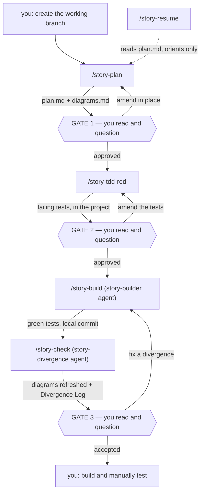

# sde-agentic-workflow

A personal, human-in-the-loop development workflow expressed as slash commands for Claude Code.
**Five steps, three comprehension gates, two durable documents per case.**

There is deliberately **no orchestrator**. You advance by typing the next command. The point is
to keep your comprehension in pace with how fast the AI generates code.

## The loop

| Step | Actor | Produces |
|---|---|---|
| 0 | **you** | the working branch |
| 1 | `/story-plan` | the case home, `plan.md`, `diagrams.md` |
| **Gate 1** | **you** | read plan and diagrams, ask until you can defend them |
| 2 | `/story-tdd-red` | failing tests encoding the acceptance criteria |
| **Gate 2** | **you** | read the tests, ask clarifying questions |
| 3 | `/story-build` | product code that turns them green — tests are untouchable |
| 4 | `/story-check` | `diagrams.md` refreshed in place + a Divergence Log |
| **Gate 3** | **you** | read the divergences, rule on each |
| 5 | **you** | build and manually test |



The only backward edges are corrective, and each re-enters the step that owns the artifact — a
divergence is fixed by rebuilding, never by editing the plan to match the code.

## Commands

| # | Command | Gate | Writes |
|---|---|---|---|
| 1 | `/story-plan [description]` | **Gate 1** — plan and diagrams | the case home, both files |
| 2 | `/story-tdd-red [case-id]` | **Gate 2** — the test contract | test files, in the project repo |
| 3 | `/story-build [case-id]` | none — the local commit is the checkpoint | product code, `## Build record`, one commit |
| 4 | `/story-check [case-id]` | **Gate 3** — divergence | `diagrams.md` in place, `## Divergence Log`, docs-only commit |
| 5 | `/story-resume [case-id]` | none — orients only | nothing (read-only) |
| 6 | `/story-explain-workflow [cmd]` | none — read-only | nothing |
| 7 | `/story-update-workflow <desc>` | **edit-plan approval** | this repo, plus one commit |

`[case-id]` is optional in 1–5: omitted, it resolves to the most recently modified case home.
Commands 6 and 7 sit outside the case loop — they take no case and write nothing to
`~/.claude/plans/`.

## The case home

A **case** is a directory. Its **case ID** is the directory name.

```
~/.claude/plans/<PARENT>/YYYY-MM-DD_<descriptive-short-name>/
├── plan.md        # status, context, scope, phases, criteria, commands, build record, divergences
└── diagrams.md    # Mermaid: component + sequence (+ state, if it earns its place)
```

- `<PARENT>` and the short name both come from **you** at intake. Never guessed.
- The date is the creation date and never changes.
- Case homes sit alongside the existing flat `*.md` plan files. Nothing migrates.
- Both files are durable. There are no transient artifacts — progress is the single
  `## Workflow status` line, which is all `/story-resume` reads.

**Line budgets**, because docs that restate the diff crowd out the comprehension the workflow is
for:

| Document | Budget |
|---|---|
| `plan.md` | ≤ 80 lines, excluding the Divergence Log and Open Questions |
| `## Divergence Log` | ≤ 3 lines per divergence |
| `## Build record` | ≤ 10 lines |
| `diagrams.md` | ≤ 3 diagrams |

Three rules make them achievable: **state each decision once**, **no code in the docs**, **never
let the docs dwarf the diff**. `## Open Questions` is exempt from every budget and is never
edited by any command — only appended to.

## What this workflow does not own

- **Version control is yours.** It never creates, switches, or merges branches, never uses
  worktrees, and never pushes. You make the branch before step 1. Its only git writes are two
  local commits per case.
- **No follow-up flow.** A follow-up is just a new case in the same parent directory.
- **No code review.** Step 4 is a *divergence* check, not an audit. Run `/code-review` and
  `/security-review` by hand when you want them.
- **No per-project config.** No config file, no framework detection. Test and build commands are
  established conversationally at intake and recorded in `plan.md`.

## Layout

```
sde-agentic-workflow/
├── README.md                             # mirror #1 — this file
├── SDE-story-workflow-explained.md       # the work system this one is adapted from (reference)
├── SDE-Workflow-wiki.pdf                 # original reference
├── plan_initial.md                       # the plan this repo implements
├── install.sh                            # idempotent symlinker: install / --check / --remove
├── commands/
│   ├── story-plan.md
│   ├── story-tdd-red.md
│   ├── story-build.md
│   ├── story-check.md
│   ├── story-resume.md
│   ├── story-explain-workflow.md         # mirror #2 — the reference is embedded here
│   └── story-update-workflow.md
├── skills/
│   ├── story-context-home/               # + templates/plan.md, templates/diagrams.md
│   ├── story-intake/
│   ├── story-diagrams/
│   └── story-tdd/
├── agents/
│   ├── story-builder.md
│   └── story-divergence.md
└── workflow-modification-plans/          # the approved edit plan behind each change to the system
```

**Commands are thin** (parse input, delegate, relay — no logic) → **skills hold the reusable
logic and the templates** → **isolated agents run the heavy build and the divergence check**.
That separation is the thing most worth protecting; if a command starts holding a rule, push the
rule down into a skill.

## Install

```sh
./install.sh            # symlink commands, skills, and agents into ~/.claude/
./install.sh --check    # report what is linked, missing, or blocked; writes nothing
./install.sh --remove   # remove only the symlinks this script created
```

The script only ever creates, replaces, or deletes a symlink that resolves back into this repo. A
real file or directory at a destination is reported as `BLOCKED` and left alone — which is what
keeps the pre-existing `~/.claude/skills/llm-wiki` safe. Re-run after a `git pull`.

## Changing the workflow

Use `/story-update-workflow <description>`. It proposes an edit plan and stops for approval, then
edits the system and syncs every mirror in one commit: the reference embedded in
`story-explain-workflow.md`, this README, the templates, and `plan_initial.md`'s layout. Prefer
it over hand-editing — a stale mirror misleads.

## Two integrations

**LLM Wiki.** `~/.claude/llmwiki/CLAUDE.md` requires every wiki project to have a matching
`~/.claude/plans/<Project>/` directory. Because case homes *are* created there, a wiki entry's
`plan-refs:` points straight at a case's `plan.md` — no copy step. The wiki schema accepts both
the flat `<plan-slug>` form and the case form `<YYYY-MM-DD_name>/plan`.

**Commit messages.** Every commit follows `~/.claude/rules/nics-rules/commit-messages.md`. The
project reference ID is the case's `<PARENT>`; the case ID is a **trailer**, not a prefix:

```
minor(ReReading): add rereading queue selection

Implements the case's three acceptance criteria end to end. The selection
pass now runs before render rather than inside it, which removes the
double-fetch on first paint.

Case: 2026-07-28_add-rereading-queue-selection
Co-Authored-By: Claude Opus 5 <noreply@anthropic.com>
```
