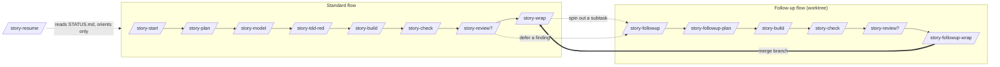

# The `/story-*` Workflow

> Generated by `/story-explain-workflow`. This is a snapshot of the human-readable mirror of the
> command/skill/agent files in the `my-workflow` repo (`/root/repos/my-workflow`). The live source
> of truth is the `/story-explain-workflow` command itself — re-run it (or `/story-update-workflow`)
> rather than hand-editing this copy.

## The idea in one breath

One Jira case = one story. Every artifact lives in a single context home, `docs/<CASE-ID>/`. Each
command does **one phase and stops at a human gate** — you advance by typing the next command,
because there is deliberately **no orchestrator** auto-chaining the steps.

The point is to keep your *comprehension* in pace with how fast the AI generates code. Three
deliberate comprehension gates enforce that:

1. You review the **shape** (`/story-model` diagrams) *before* code
2. You author the **contract** (`/story-tdd-red` tests) *before* code
3. You confirm the **refreshed shape** (`/story-check` divergence log) *after* code

`/story-plan` adds a fourth gate — approving the plan itself.

### Two rules for the diagrams

The diagrams are the teaching surface, so they follow two rules:

- **One set, always current** — `/story-check` edits the diagrams **in place** rather than appending
  an "as-built" copy, because two renderings of one design guarantee one is wrong with no way to
  tell which. What changed and why lives in the **Divergence log**.
- **One altitude, no junior/mid/senior tiers** — the gap a less experienced reader has is vocabulary
  and causality, not granularity. So `ARCHITECTURE.md` carries a **Concepts in this story** list and
  a **Why not the obvious thing** section instead of extra boxes. Depth is generated live in the
  session, on demand, and never committed. *Tier the conversation, not the artifacts.*

### Transient vs. durable artifacts

Artifacts come in two kinds, which decides how long they live and how much detail they carry:

| Kind | Files | Lifetime | Budget |
|---|---|---|---|
| **Transient** | `STATUS.md`, `STATE.json` | Pure mid-flight handoff — **deleted by the wrap** | — |
| **Durable** | `RESEARCH.md`, `PLAN.md`, `ARCHITECTURE.md`, `IMPLEMENTATION.md`, `REVIEW.md` | Rides in the PR forever | `PLAN.md` ≤80 lines (≤60 follow-up); `IMPLEMENTATION.md` ≤40 |

The budgets exist because docs that restate the research and the diff crowd out the comprehension
the workflow is for: state each decision **once**, keep code out of the docs, and never let the docs
dwarf the diff. `## Open Questions` is the one exempt section — you answer inline there and your
words are never edited.

Commands are thin (parse input, delegate); the reusable logic lives in **skills**
(`story-context-home`, `story-architecture-diagram`) and the heavy build runs in an isolated
**agent** (`story-builder`). They also delegate into team skills the repo doesn't own:
`engineering-jira-gathering`, `llmwiki-research`, `engineering-tdd`, and the reviewer agents.

---

## Workflow sketch

**Standard flow** (a top-level story via `/story-start`):

```
/story-start ──▶ /story-plan ──▶ /story-model ──▶ /story-tdd-red ──▶ /story-build ──▶ /story-check ──▶ [/story-review] ──▶ /story-wrap
   research         plan            diagrams          failing tests      (agent)        refresh + suite     (optional)       wiki+jira+drop status
   (review)      ⟨approve⟩      ⟨quiz + narrate⟩   ⟨approve tests⟩     commit ▮      ⟨review divergences⟩ ⟨triage⟩           commit ▮▮
     │              │               │                  │                                    │                                    │
     └──────────────┴───────────────┴── ⟨gate⟩ = control returns to you ──┴────────────────┴────────────────────────────────────┘

/story-resume ─ fresh-session entry point: reads STATUS.md, tells you the next command. Never advances the flow.
```

**Follow-up flow** (a bug or review comment as a Jira subtask, in its own git worktree — the
compressed path that skips `/story-model` and `/story-tdd-red`):

```
/story-followup <SUB> <PARENT> ──▶ /story-followup-plan ──▶ /story-build ──▶ /story-check ──▶ [/story-review] ──▶ /story-followup-wrap
   worktree + link + research         plan + test changes      (agent, followup)  diff + suite     (optional)       wrap + drop status + merge
   (no research gate)               ⟨approve — only gate⟩      commit ▮            commit ▮                              commit ▮ + merge
```

`▮` marks a **local commit** (never a push). Re-running `/story-followup <SUB> <PARENT>` reuses the
worktree for another **round** (build → manual-test → find-an-issue → go again).

The same view in Mermaid, for rendering in Jira / GitHub / an editor:



---

## Standard flow — per command

Each entry names four things: **who** the human is responsible for, **what** the AI does, the
**gate** where control returns to you, and the **docs** the step creates or updates.

### `/story-start <CASE-ID> [desc]`
- **You:** name the Jira case (a `<PROJECT>-<NUMBER>` key in the free-text `desc` declares a
  parent → this is a subtask). Skim the research summary before planning.
- **AI:** gather Jira context (`engineering-jira-gathering` skill: TI → Epic → Story → Task,
  links, comments), research the codebase (`llmwiki-research` skill, persisting to the wiki),
  and scaffold the context home (`story-context-home` skill).
- **Gate:** a soft pause — presents the RESEARCH summary (risk, approach, open questions) and
  waits; it does **not** auto-advance to planning.
- **Docs:** creates `docs/<CASE-ID>/` with `RESEARCH.md`, `STATUS.md`, `STATE.json`
  (`current_step: started`, `next: /story-plan`). Subtask path also sets the parent pointers and
  appends a row to the parent's **`PLAN.md`** `## Follow-ups` (a durable artifact, so the map
  survives the parent's wrap).

### `/story-plan [CASE-ID]`
- **You:** answer the open questions and **approve the plan**.
- **AI:** read `RESEARCH.md`, write `PLAN.md` from the `story-context-home` template — scope
  (building / not building), 2–4 phases with per-phase validation, and acceptance criteria
  phrased as observable behaviors (these become the red tests). Held to a **≤80-line budget**:
  each decision stated once (the criteria are canonical, phases reference them), no code or line
  numbers, and the plan must not dwarf the diff.
- **Gate:** **plan-approval gate** — stops, presents scope / phases / acceptance criteria /
  open questions; amends `PLAN.md` in place from your answers (never a new file). Your answers go
  in `## Open Questions`, which is **exempt from the budget and never edited** — write as much
  as you like there.
- **Docs:** creates `PLAN.md`; updates `STATUS.md` + `STATE.json` (`planned`, `next: /story-model`).

### `/story-model [CASE-ID]`
- **You:** **answer three questions, then narrate the sequence flow back in your own words.** Ask
  for a zoom-in on any arrow that didn't land.
- **AI:** `story-architecture-diagram` skill in **PLANNED** mode — from `PLAN.md` + `RESEARCH.md`,
  produce (in reading order) a **Concepts in this story** list, a plain-English model, a component
  diagram, a sequence diagram, a state diagram if warranted, **Why not the obvious thing**, and
  **Read the code in this order** — all diagrams in Mermaid.
- **Gate:** **comprehension / shape gate** — a two-minute design review that catches problems
  while they're cheap. **The AI quizzes you first** (one question on the happy path, one on a
  failure mode, one on a rejected alternative) *before* inviting your questions — your own
  questions are bounded by your mental model, so wrong answers find the gaps that questions miss.
  Then you narrate the sequence back. Zoom-in diagrams are drawn **in the conversation only** and
  never written to a file.
- **Docs:** creates `ARCHITECTURE.md` (`Status: PLANNED`); updates `STATUS.md` + `STATE.json`
  (`modeled`, `next: /story-tdd-red`).

### `/story-tdd-red [CASE-ID]`
- **You:** **read and approve the failing tests.** They are the contract the build must satisfy.
- **AI:** `engineering-tdd` skill scoped to the red phase — write tests that encode the
  acceptance criteria as intended behavior (Vitest + RTL + axe for cpanel-meridian), each setup
  step and assertion commented for a junior reader, then run them and confirm they fail *for the
  right reason*.
- **Gate:** **contract gate** — presents the tests + red output; no product code is written until
  you approve. The same pass never writes tests *and* code (that yields green-but-meaningless tests).
- **Docs:** writes the test files (in the project, not `docs/`); updates `STATUS.md` +
  `STATE.json` (`tested-red`, `next: /story-build`).

### `/story-build [CASE-ID]`
- **You:** nothing during the run (it's isolated). Read the returned summary, then run `/story-check`.
- **AI:** launches the **`story-builder`** agent (`subagent_type: story-builder`) so
  implementation detail stays out of the main context. The agent reads `STATE.json`'s `workflow`
  mode — `standard`: make product code satisfy the existing red tests (never edit them);
  `followup`: author the planned tests *and* code together — implements all phases to green, then
  commits locally.
- **Gate:** no human gate; the **local commit** is the checkpoint. The main session relays the
  agent's summary (phases, test result, commit hash, any deviation).
- **Docs:** standard flow — agent creates `IMPLEMENTATION.md` (**≤40 lines**); follow-up flow —
  agent appends a trimmed `## Build close-out` to `PLAN.md` (**≤6 lines**, no `IMPLEMENTATION.md`).
  Both record the **verification verdict, not the transcript** — one line of `make test ✓ N/N ·
  typecheck ✓ · lint ✓`, with raw output pasted only on a failure. The agent still runs the real
  commands and reads real output; "never claim results" is untouched. Either way updates
  `STATUS.md` + `STATE.json` (`built`, `next: /story-check`). Local commit of product code +
  `docs/` artifacts, tagged with the case ID(s) — **never pushed**.

### `/story-check [CASE-ID]`
- **You:** **review the divergences** (your primary target — a misplaced arrow is visible where a
  wrong line of code is not) and narrate the refreshed sequence back.
- **AI:** `story-architecture-diagram` skill in **REFRESH (in place)** mode — re-derive the shape
  from the actual changed code (`git diff` + reading files), **edit the existing diagrams in place**
  so they describe what shipped, and fill the **Divergence log**; also top up **Concepts in this
  story** and swap real `file:line` entry points into **Read the code in this order**. Then run the
  full quality gate (`make verify`) and capture real output.
- **Gate:** **divergence gate** — presents the divergence log + suite results; walks you through
  whether each divergence was intentional.
- **Docs:** standard flow — refreshes the story's `ARCHITECTURE.md` **in place** (no second
  "as-built" copy is ever appended; the log records what moved and why, and git history keeps the
  earlier revision); follow-up flow — amends the **parent's** `ARCHITECTURE.md` and appends a
  divergence note there (no per-follow-up diagram). Either way updates `STATUS.md`, `STATE.json`
  (`checked`, `next: /story-review` or `/story-wrap`). A **docs-only** local commit (product code
  was already committed by build) — never pushed.

### `/story-review [CASE-ID]`  *(optional)*
- **You:** triage findings — for each blocker, decide **fix now** (loop back to build) or **defer
  as a subtask** (file a Jira subtask, then `/story-followup <SUB> <CASE-ID>`).
- **AI:** dispatch the reviewer agents over the branch diff (`engineering-reviewer`, or the
  `code-quality-reviewer` / `security-reviewer` / `accessibility-reviewer` agents as fits the
  change) and aggregate into `REVIEW.md` with a single APPROVED | NEEDS_FIX verdict.
- **Gate:** findings-triage gate — presents the verdict + findings table.
- **Docs:** creates `REVIEW.md`; updates `STATUS.md` + `STATE.json` (`reviewed`, `next: /story-wrap`).

### `/story-wrap [CASE-ID]`
- **You:** read the confirmation. You push when ready (wrap never pushes).
- **AI:** update the durable **LLM Wiki** pages (`llmwiki-research` skill — cross-cutting "how the
  system works now", not per-story notes); post a **short** Jira status comment with links to the
  durable `docs/<CASE-ID>/` artifacts (Markdown, not full pastes); then **delete the transient pair**
  — reading the case IDs out of `STATE.json` first, since the commit tag needs them. Subtask: flip
  its row in the parent's `PLAN.md` `## Follow-ups` to `wrapped`.
- **Gate:** none — terminal for the standard flow.
- **Docs:** **deletes `STATUS.md` + `STATE.json`** — with the story finished there is no next command
  to point at, and the durable artifacts hold everything worth keeping, so the handoff pair leaves
  the merged diff entirely. For a subtask, edits the parent's `PLAN.md` row. Updates LLM Wiki pages.
  **Two local commits** (project docs; wiki repo) — never pushed.

---

## Follow-up flow — per command

The compressed path for bugs and review comments spun out as **Jira subtasks**, each in its
**own git worktree** (`/root/worktrees/<repo>/<SUB-ID>`) so several run in parallel. It skips
`/story-model` and `/story-tdd-red`; the test contract is folded into the plan and authored
during the build. Between `/story-followup-plan` and the end, it reuses the **standard**
`/story-build`, `/story-check`, and `/story-review` — all run **from the worktree**. Those
shared steps keep the **compressed 3-file home** (`STATE.json` + `STATUS.md` + `PLAN.md`): the
build close-out folds into `PLAN.md` (no `IMPLEMENTATION.md`) and `/story-check` amends the
**parent's** `ARCHITECTURE.md` in place and logs the divergences there (no per-follow-up diagram).

### `/story-followup <FOLLOWUP-ID> <PARENT-ID>`
- **You:** name **both** keys (the parent is required — the AI never infers it from Jira).
  Approve the plan at the end (that gate is owned by `/story-followup-plan`). Run everything
  after from the worktree.
- **AI:** create or reuse a git worktree on a branch named for the follow-up, based on the
  parent's branch (the parent may be in progress *or* already wrapped); confirm the parent's home
  rode along; gather the subtask's Jira context (`engineering-jira-gathering`); do **targeted**
  research only (not the parent's full pass); scaffold the follow-up home with
  `workflow: followup` + worktree/branch/round; register the row on the parent; then run
  `/story-followup-plan`. Re-entry reuses the worktree and opens a new **round**.
- **Gate:** no research gate — the whole point is speed. It ends at the plan gate below.
- **Docs:** creates the **compressed 3-file home** `docs/<FOLLOWUP-ID>/` (`STATUS.md`,
  `STATE.json`, and a `PLAN.md` stub holding the "Builds on parent (delta research)" section)
  **inside the worktree** — no standalone `RESEARCH.md`/`ARCHITECTURE.md`/`IMPLEMENTATION.md`;
  appends the `## Follow-ups` row on the parent's **`PLAN.md`** (which is why a wrapped parent can
  still take a follow-up — its `STATUS.md` is long gone). Re-entry appends a `## Round N` section
  to `PLAN.md`, ≤10 lines. Only `PLAN.md` survives the follow-up's own wrap.

### `/story-followup-plan [CASE-ID]`
- **You:** answer the open questions and **approve** — this is the follow-up flow's **only gate**.
- **AI:** read the `PLAN.md` stub (its "Builds on parent (delta research)" section) + the parent's
  `RESEARCH.md` / `PLAN.md` / `ARCHITECTURE.md`; fill in `PLAN.md` with scope, 1–3 phases,
  acceptance criteria, **and a `## Test changes` section** that enumerates the exact test
  files/cases to add or update (the contract `/story-build` implements — tests + code together),
  leaving the `## Build close-out` for the build. Runs from the worktree; re-entry amends in place.
  Held to a **≤60-line budget** covering *everything* — delta research, scope, phases, criteria,
  test changes, and the close-out appended later. Five sections here can each describe the same
  change; the criteria are canonical and the rest point at them.
- **Gate:** **plan-approval gate** — presents scope / phases / acceptance criteria + the
  enumerated test changes. Your answers land in `## Open Questions` — exempt from the budget and
  never edited.
- **Docs:** creates/amends `PLAN.md` (with `## Test changes`); updates `STATUS.md` + `STATE.json`
  (`planned`, `next: /story-build` — no `/story-model`, no `/story-tdd-red`).

*(Then `/story-build` in `followup` mode → `/story-check` → optional `/story-review`, exactly as
in the standard flow, all from the worktree.)*

### `/story-followup-wrap [CASE-ID]`
- **You:** resolve any **code** merge conflicts it surfaces and confirm the main checkout is clean
  on the parent branch. Remove the worktree/branch yourself later. You push when ready.
- **AI:** **Part A (in the worktree)** — the `/story-wrap` duties: update the LLM Wiki, post the
  short Jira status, **delete the transient pair**, flip the parent's `PLAN.md` `## Follow-ups` row,
  commit the wrap docs on the follow-up branch (+ a wiki-repo commit). **Part B (in the main
  checkout)** — merge the follow-up branch into the parent branch (`git merge --no-ff`), resolving
  the `## Follow-ups` conflict (now in the parent's `PLAN.md`) by keeping all rows and **stopping on
  any code conflict**. Leaves the worktree and branch in place; never pushes.
- **Gate:** conflict-resolution stops as needed; otherwise terminal for the follow-up flow.
- **Docs:** **deletes `STATUS.md` + `STATE.json`**, leaving `PLAN.md` as the follow-up's sole durable
  artifact; edits the parent's `PLAN.md` `## Follow-ups` row; updates LLM Wiki pages; produces a
  **merge commit** on the parent branch. All local — never pushed.

---

## Entry point (any time)

### `/story-resume [CASE-ID]`
- **You:** the fresh-session entry point — pick which story if several are in flight.
- **AI:** resolve the case from the argument or the most-recently-updated `docs/*/STATE.json`
  (**also enumerating `git worktree list`** so in-flight follow-ups are found); read `STATUS.md`
  + `STATE.json`; report current step, what's done, what's in flight, open questions, and the
  `next_command`; pre-read the artifacts for that next step. If `STATE.json` has a `worktree`
  path, tells you to `cd` there first. Because the wrap deletes the pair, **that glob matches only
  live stories** — no filtering needed; a `docs/<CASE-ID>/` without a `STATE.json` is reported as
  already wrapped (and still open to a new `/story-followup`).
- **Gate:** none — orients and hands back. Never performs the next step.
- **Docs:** read-only.

---

## Maintaining the system (meta commands)

These don't touch a story — they operate on the `/story-*` system itself (the `my-workflow` repo).

### `/story-explain-workflow [command-name]`
- **You:** run it to learn or re-check the system; optionally name one command to focus on.
- **AI:** present this reference — the whole system, or one command's entry — from the content
  embedded in the command file (no repo scan). Reads one command's own file only if you ask for
  detail beyond the reference.
- **Gate:** none — read-only, no side effects.
- **Docs:** none. It *is* the human-readable mirror of the command/skill/agent files.

### `/story-update-workflow <desc>`
- **You:** describe the change to the system, then **approve the edit plan**. You push the repo
  when ready (it never pushes).
- **AI:** edit the `my-workflow` repo pieces the change touches (commands / skills / agent /
  templates), then keep every mirror in sync — **this reference (`/story-explain-workflow`)**, the
  `README.md` table/count/layout, the artifact templates, and the **team Confluence page** ("Updated
  SDE Workflow" — its `Implemented` and `WORKFLOW FLOWCHART DIAGRAM` sections) — refresh the
  `~/.claude` symlinks via `install.sh` if a file was added/removed, and commit locally.
- **Gate:** **edit-plan gate** — lists the files it will change and how the reference, README, and
  (outward-facing) Confluence page stay in sync; waits for approval before writing or publishing;
  then runs through to the commit.
- **Docs:** whatever the change touches; always the `/story-explain-workflow` mirror and, when the
  command set / a step / the flow changes, the `README.md` and the Confluence page. A single local
  commit (no Jira ID, this repo's convention) — never pushed; the Confluence edit is a live publish.

---

## Supporting cast (not commands you run)

- **`story-context-home` skill** — the conventions for `docs/<CASE-ID>/`: every artifact's shape
  and **line budget** (`templates/STORY-ARTIFACTS.md`), the **transient-vs-durable** split, the
  `STATUS.md` handoff rule and its deletion at wrap, the `STATE.json` resume pointer, the
  subtask/worktree model (including the parent's `PLAN.md` follow-up map), and the commit-message
  case-ID tagging (`Case: <CASE-ID>`, or `Case: <PARENT> > <CASE-ID>` for a subtask).
- **`story-architecture-diagram` skill** — the PLANNED (`/story-model`) and REFRESH-in-place
  (`/story-check`) diagram modes, the divergence log, the `ARCHITECTURE.md` section order
  (Concepts → shape → Why-not → code pointers), the adversarial quiz that opens the comprehension
  gate, and the "one set, one altitude" rules with the rationale for rejecting detail tiers. In the
  follow-up flow, its parent-update mode amends the parent's `ARCHITECTURE.md` instead of drawing
  a fresh per-follow-up diagram.
- **`story-builder` agent** — runs the `/story-build` phase in an isolated context so the main
  session stays clean; branches on `STATE.json.workflow`; commits locally.
- **Team skills/agents borrowed:** `engineering-jira-gathering` (context), `llmwiki-research`
  (research + wiki), `engineering-tdd` (red tests), and the reviewer agents.

---

*Maintenance: the `/story-explain-workflow` command is the human-readable mirror of the
command/skill/agent files in the `my-workflow` repo. When you change what a command does — its gate,
the docs it writes, or the skills it calls — the matching entry there must change in the same commit,
the way the design-system rule keeps Storybook and the overview in sync. A stale explanation
misleads. **`/story-update-workflow` automates this** — it edits the system and syncs the reference
(and the README) in one gated, committed pass; prefer it over hand-editing those files. This
exported copy is not on that sync path — regenerate it when the system changes.*
