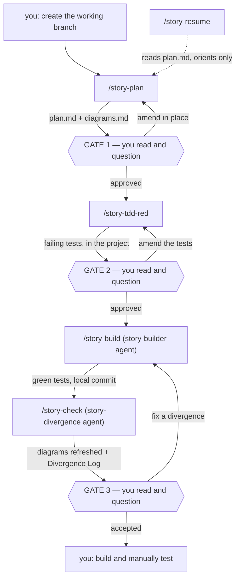

# /story-explain-workflow

Presents the reference **embedded below**. It does not scan the repo, list directories, or read
the command files — the reference is embedded precisely so that explaining the workflow costs one
file read and cannot describe a command that no longer exists.

Argument (optional): `$ARGUMENTS` — a command name (with or without the leading slash). Given
one, present just that command's entry plus the gate that follows it. Given nothing, present the
whole reference. Read only a command's own file if the user asks for detail beyond what is here.

**This is a mirror.** When `/story-update-workflow` changes what a command does, it updates the
reference below in the same pass. A stale explanation misleads; keep them in one commit.

---

# The `/story-*` workflow

## The idea in one breath

One case = one unit of work. Everything the workflow writes about it lives in one case home,
`~/.claude/plans/<PARENT>/YYYY-MM-DD_<short-name>/`, as two durable files. Each command does one
step and **stops at a human gate** — you advance by typing the next command, because there is
deliberately **no orchestrator**.

The point is to keep your *comprehension* in pace with how fast the AI generates code. Three
gates enforce it:

1. You review the **shape** — the plan and diagrams — *before* any code (`/story-plan`)
2. You approve the **contract** — the failing tests — *before* any code (`/story-tdd-red`)
3. You confirm the **refreshed shape** — the divergence log — *after* the code (`/story-check`)

## The loop

| Step | Actor | Produces |
|---|---|---|
| 0 | **you** | the working branch |
| 1 | `/story-plan` | the case home, `plan.md`, `diagrams.md` |
| **Gate 1** | **you** | read plan and diagrams, ask until you can defend them |
| 2 | `/story-tdd-red` | failing tests encoding the acceptance criteria |
| **Gate 2** | **you** | read the tests, ask clarifying questions |
| 3 | `/story-build` | product code that turns them green — tests are untouchable |
| 4 | `/story-check` | `diagrams.md` refreshed in place + a Divergence Log |
| **Gate 3** | **you** | read the divergences, rule on each |
| 5 | **you** | build and manually test |



The only backward edges are corrective, and each re-enters the step that owns the artifact — a
divergence is fixed by rebuilding, **never** by editing the plan to match the code.

## What this workflow does not own

- **Version control is yours.** It never creates, switches, or merges branches, never uses
  worktrees, and never pushes. You make the branch before step 1. Two local commits per case —
  the builder's, and `/story-check`'s docs-only one — are its only git writes.
- **No follow-up flow.** A follow-up is just a new case in the same parent directory.
- **No code review.** Step 4 is a *divergence* check, not an audit. `/code-review` and
  `/security-review` remain available to run by hand.
- **No per-project config.** No config file, no framework detection. Test and build commands are
  established conversationally at intake and recorded in `plan.md`.

## The case home

```
~/.claude/plans/<PARENT>/YYYY-MM-DD_<descriptive-short-name>/
├── plan.md        # status, context, scope, phases, criteria, commands, build record, divergences
└── diagrams.md    # Mermaid: component + sequence (+ state, if it earns its place)
```

`<PARENT>` and the short name both come from **you** at intake — never guessed. The date is the
creation date and never changes. Case homes sit alongside the existing flat `*.md` plan files;
nothing migrates. Both files are durable; there are no transient artifacts. Progress is the one
`## Workflow status` line, which is all `/story-resume` reads.

**Budgets:** `plan.md` ≤ 80 lines excluding the Divergence Log and Open Questions; ≤ 3 lines per
divergence; `## Build record` ≤ 10 lines; `diagrams.md` ≤ 3 diagrams. Three rules make them
work: state each decision once, no code in the docs, never let the docs dwarf the diff.
`## Open Questions` is exempt from every budget and is never edited by any command — only
appended to.

## Per command

### `/story-plan [description]` — step 1
- **You:** answer intake, then read the plan and diagrams and question them until you could
  defend them.
- **AI:** runs `story-intake` (the change, the `<PARENT>`, the repo and branch, an approved short
  name, the test and build commands), creates the case home, writes `plan.md` from the
  `story-context-home` template and `diagrams.md` in `story-diagrams` PLANNED mode.
- **Gate 1** — plan-and-shape. Answers amend both files **in place**, never a new file.
- **Writes:** the case home, both files. Status → `planned`. No commit.
- **Never:** guesses the parent, invents a case ID, touches the project repo, or branches.

### `/story-tdd-red [case-id]` — step 2
- **You:** read and approve the failing tests. They are the contract the build cannot change.
- **AI:** `story-tdd` skill, red phase only — each acceptance criterion becomes a test of
  *intended behavior*, every setup step and assertion commented for a junior reader; runs them
  with the narrow command from `## Commands` and confirms they fail **for the right reason**
  (not-implemented, not an assertion mismatch against an accidental partial build).
- **Gate 2** — the contract. The same pass never writes tests *and* product code.
- **Writes:** test files **in the project repo**. Status → `tested-red`. No commit.
- **Scope note:** TDD the logic — validation, transforms, state machines, hooks. Leave pure
  rendering to your manual test in step 5.

### `/story-build [case-id]` — step 3
- **You:** nothing during the run; read the returned summary.
- **AI:** launches the **`story-builder`** agent in an isolated context. It makes product code
  satisfy the existing red tests and **never edits, deletes, skips, or relaxes a test** — if a
  test looks wrong it stops and reports. Implements all phases to green, runs the real test and
  build commands, records the **verdict not the transcript** (`test ✓ 24/24 · build ✓`), appends
  `## Build record` (≤ 10 lines), and commits locally.
- **Gate:** none — the local commit is the checkpoint.
- **Writes:** product code, `## Build record`, status → `built`. One local commit, never pushed.

### `/story-check [case-id]` — step 4
- **You:** rule on each divergence — intentional or not.
- **AI:** launches the **`story-divergence`** agent, isolated so it re-derives the shape from
  `git diff` and the changed files rather than from the builder's account. `story-diagrams`
  REFRESH mode edits `diagrams.md` **in place**, swaps real `file:line` pointers into
  `## Read the code in this order`, and appends `## Divergence Log` — one entry per difference,
  ≤ 3 lines, saying *what changed*, *why*, and *whether it matters*.
- **Gate 3** — divergence.
- **Writes:** `diagrams.md` (in place), `## Divergence Log`, status → `checked`. A docs-only
  local commit.
- **Never:** edits the plan to agree with the code; reviews code quality.

### `/story-resume [case-id]`
- **You:** the fresh-session entry point; pick which case if several are live.
- **AI:** resolves from the argument or the most recently modified case home, reports the status
  line, scope, open questions, and **the next command spelled out**, then pre-reads that step's
  inputs.
- **Gate:** none — orients and hands back. **Never advances.** Strictly read-only.

### `/story-explain-workflow [command-name]`
- **You:** run it to learn or re-check the system.
- **AI:** presents this reference, embedded in the command file. No repo scan, no directory
  listing. Read-only, no side effects.

### `/story-update-workflow <description>`
- **You:** describe the change, then **approve the edit plan**.
- **AI:** proposes what it will change and stops. On approval it edits the command, skill, or
  agent, then syncs every mirror in the same pass — this embedded reference, `README.md`, the
  templates under `skills/story-context-home/templates/`, and `plan_initial.md`'s §6 layout if a
  file was added or removed. Re-runs `install.sh` when the file set changed, saves the approved
  edit plan under `workflow-modification-plans/`, and makes one local commit with **no `Case:`
  trailer** — changes to the workflow itself are not cases.
- **Gate:** the edit-plan gate, before anything is written.

## Supporting cast (not commands)

- **`story-context-home` skill** — the load-bearing one: the case home path convention and
  `YYYY-MM-DD_<name>` format, case-ID resolution, both documents' shape, the line budgets, the
  `## Workflow status` line and its allowed values (`planned` → `tested-red` → `built` →
  `checked` → `done`), the `## Open Questions` exemption, the artifact templates, and the
  commit-message format (`<type>(<PARENT>): <subject>` + 80-column body + `Case:` trailer).
- **`story-intake` skill** — the conversational gathering that opens a case. Never guesses the
  parent, never invents a case ID, never writes a config file into the project.
- **`story-diagrams` skill** — PLANNED and REFRESH-in-place modes, the section order, and the two
  rules: **one set, always current** (edit in place, never append an as-built copy) and **one
  altitude, no tiers** (zoom-ins are drawn in conversation only, never written to a file).
- **`story-tdd` skill** — the red phase only; the same pass never writes tests and product code.
- **`story-builder` agent** — the isolated build; tests are untouchable; commits locally.
- **`story-divergence` agent** — the isolated re-derivation; refreshes the diagrams, logs the
  divergences; not a code review.
- **`llm-wiki` skill** (pre-existing, not part of this repo) — consulted read-only at intake for
  prior art. A wiki entry's `plan-refs:` can point at a case home's `plan.md` directly.

## Installation

Commands, skills, and agents live in `/home/nic/repos/sde-agentic-workflow` and are symlinked
into `~/.claude/` by `install.sh` (`install` / `--check` / `--remove`). The script only ever
touches symlinks that resolve back into that repo, so anything else in `~/.claude/skills/` is
safe. Re-run it after a `git pull`.
