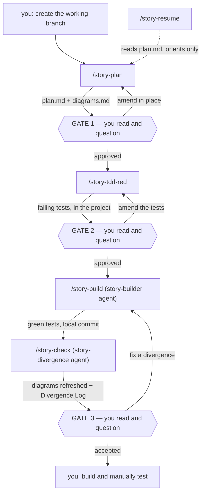

# Implementation Plan — A Personal SDE Workflow for This Machine

> Source material: `SDE-story-workflow-explained.md` (the human-readable mirror of the work
> system) and `SDE-Workflow-wiki.pdf` (the Confluence page: original prompts, Claude's
> assessment, and the "Implemented" write-up).
> Target: a **deliberately smaller** system on this personal machine — four workflow steps,
> three comprehension gates, two durable documents per case.

---

## 1. What we are building

A personal, human-in-the-loop development workflow expressed as slash commands. **No
orchestrator** — you advance by typing the next command. Every case's documentation lives in
its own directory under `~/.claude/plans/<PARENT>/`.

The architecture from the work system is preserved exactly, because it is what makes the
system maintainable: **commands are thin** (parse input, delegate, hold no logic) → **skills
hold reusable logic and templates** → **isolated agents run the heavy build and the
divergence check**.

What is *not* preserved is the size. The work system had 14 commands, 6 durable artifacts,
transient state files, a follow-up/worktree flow, and a reviewer aggregation step. This one
has **5 commands and 2 durable documents**.

### The loop

| Step | Actor | Produces |
|---|---|---|
| 0 | **You** | the working branch (see §2) |
| 1 | `/story-plan` | the case directory, `plan.md`, `diagrams.md` |
| **Gate 1** | **You** | read the plan and diagrams, ask questions until you can defend them |
| 2 | `/story-tdd-red` | failing tests that encode the acceptance criteria |
| **Gate 2** | **You** | read the tests, ask clarifying questions |
| 3 | `/story-build` | product code that turns the tests green — **tests are untouchable** |
| 4 | `/story-check` | `diagrams.md` refreshed in place + a **Divergence Log** in `plan.md` |
| **Gate 3** | **You** | read the Divergence Log, ask clarifying questions |
| 5 | **You** | build and manually test the implementation |

---

## 2. Boundaries — what this workflow does *not* own

These are stated up front because they shaped every decision below.

- **Version control is yours.** The workflow never creates branches or worktrees, never
  switches branches, and never merges. You set up the working branch before step 1. The
  builder's local commits are the only git writes the system performs, and it never pushes.
- **No follow-up / subtask flow.** A follow-up is just a new case in the same parent
  directory. There is no worktree lifecycle, no parent/child bookkeeping, no merge step.
- **No code-review or security-review aggregation.** Step 4 is a *divergence* check — plan
  and diagrams versus what was actually built — not a code audit. The built-in `/code-review`
  and `/security-review` skills remain available to run by hand whenever you want them.
- **No per-project configuration file.** No `.story-workflow.json`, no framework detection.
  Test and verify commands are established conversationally during intake and recorded in
  `plan.md`.

---

## 3. Current state of this machine

| Thing | Status |
|---|---|
| `~/.claude/commands/` | **absent** — no slash commands installed |
| `~/.claude/agents/` | **absent** — no agents installed |
| `~/.claude/skills/` | exists; contains **only** `llm-wiki` |
| `~/.claude/llmwiki/` | **exists and populated** — schema in `CLAUDE.md`, projects `CurrentEvents`, `ReReading` |
| `~/.claude/plans/<PARENT>/` | exists — `CurrentEvents`, `ReReading`, each holding flat `*.md` plan files |
| `~/.claude/rules/nics-rules/commit-messages.md` | exists — governs every commit this system makes |
| `~/.claude/settings.json` | model `opus`; denies `git push *` and `git checkout *` |
| `git` 2.43.0, `node` v24.15, `npm` 11.12, `python3` 3.11, `make` 4.3 | installed |
| `gh`, `jira`, `acli` | **not installed** |
| This directory | **not a git repo** |

The two denied permissions no longer matter: nothing in this workflow pushes, and nothing
switches branches.

---

## 4. The case home

A **case** is a directory. A **case ID** is that directory's `<descriptive-short-name>`.

```
~/.claude/plans/<PARENT>/YYYY-MM-DD_<descriptive-short-name>/
├── plan.md        # scope, phases, acceptance criteria, test commands, Divergence Log
└── diagrams.md    # Mermaid: component + sequence (+ state, if it earns its place)
```

Example: `~/.claude/plans/CurrentEvents/2026-07-28_add-new-page-to-currentEvents-app/`

Rules:

- The date is the date the case is created; it never changes afterward.
- `<PARENT>` is chosen **by you during the intake conversation** — an existing directory
  (`CurrentEvents`, `ReReading`) or a new one you name. `/story-plan` never guesses it.
- Case directories sit alongside the existing flat `*.md` plan files. Nothing migrates.
- Both documents are **durable**. There are no transient artifacts — no `STATUS.md`, no
  `STATE.json`. Progress is a single `## Workflow status` line at the top of `plan.md`,
  updated by each command, which is all `/story-resume` needs to orient.

### Line budgets

Carried over from the work system, because they are the whole reason the docs stay readable:

| Document | Budget |
|---|---|
| `plan.md` | ≤ 80 lines, excluding the Divergence Log and Open Questions |
| `plan.md` → `## Divergence Log` | ≤ 3 lines per divergence |
| `diagrams.md` | ≤ 3 diagrams |

Three rules govern them: **state each decision once**, **no code in the docs**, and **never
let the docs dwarf the diff**. `## Open Questions` is exempt from every budget and is never
edited by any command — only appended to.

---

## 5. Adaptation decisions (work system → this machine)

| Work system | Here | Why |
|---|---|---|
| Repo `/root/repos/my-workflow` | **`/home/nic/repos/sde-agentic-workflow`** (`git init` it) | Keep the system next to the documents that describe it |
| Artifacts in `docs/<CASE-ID>/` inside the project repo | **`~/.claude/plans/<PARENT>/YYYY-MM-DD_<name>/`** | Documentation is yours, not the project's; keeps personal repos clean and satisfies the wiki rule below for free |
| 6 durable artifacts (`CASE`, `RESEARCH`, `PLAN`, `ARCHITECTURE`, `IMPLEMENTATION`, `REVIEW`) | **`plan.md` + `diagrams.md`** | Intake context, research, and the build record are *sections* of `plan.md`, not separate files |
| `<PROJECT>-<NUMBER>` case IDs from Jira | **`YYYY-MM-DD_<descriptive-short-name>`** | No tracker here; the date sorts and the name is self-describing, so no ID ledger is needed |
| `engineering-jira-gathering` (team skill) | **new `story-intake` skill** | Case context is gathered conversationally and written into `plan.md` |
| `llmwiki-research` (team skill) | **existing `llm-wiki` skill** | Already installed and populated — reuse, do not fork |
| `engineering-tdd` (team skill) | **new `story-tdd` skill** | Scoped to the red phase only |
| `story-model` shape gate with an AI-run quiz | **folded into Gate 1** | Step 1 produces the diagrams alongside the plan, so one gate covers both; comprehension is driven by *your* questions, not a quiz |
| `make verify` / `.story-workflow.json` | **test commands recorded in `plan.md` during intake** | Two personal projects, established once by asking |
| Confluence mirror page | **`README.md` + a regenerated `SDE-story-workflow-explained.md`** | The in-repo mirrors that must stay in sync |

### Two integrations the work system did not have

**A. The LLM Wiki hard rule — now satisfied structurally.** `~/.claude/llmwiki/CLAUDE.md`
requires every wiki project to have a matching `~/.claude/plans/<Project>/` directory. Because
case homes *are* created under `~/.claude/plans/<PARENT>/`, a wiki entry's `plan-refs:` can
point straight at this workflow's output. No copy step, no wrap command.

The wiki schema does not describe that shape yet, so **Phase 1 includes editing
`~/.claude/llmwiki/CLAUDE.md`** to look one directory deeper. Three places:

| Line | Today | Change to |
|---|---|---|
| 54 (`plan-refs:` comment) | "plan filenames (without `.md`) under `~/.claude/plans/<Project>/`" | also accepts a **case-directory path**, `YYYY-MM-DD_<name>/plan` |
| 63 (linking rule) | "Link to plan files by relative or absolute path" | unchanged, but state that a case home's two files are linked individually, not as a directory |
| 117 (lint rule) | "Every plan under `~/.claude/plans/<Project>/` is referenced by at least one entry's `plan-refs:`" | a **case directory** counts as one plan for this rule — its `plan.md` is what must be referenced |

Both forms stay legal: the existing flat `*.md` plans keep working unchanged, and new cases
reference `<YYYY-MM-DD_<name>>/plan`. This is a schema edit, not a migration — nothing under
`~/.claude/plans/` moves.

**B. Commit message format.** `~/.claude/rules/nics-rules/commit-messages.md` mandates
`type(ProjectRef): description` + a blank line + an 80-column body. The project reference ID
is the case's **`<PARENT>`**; the case ID becomes a **trailer**, not a prefix:

```
minor(ReReading): add rereading queue selection

Implements the case's three acceptance criteria end to end. The selection
pass now runs before render rather than inside it, which removes the
double-fetch on first paint.

Case: 2026-07-28_add-rereading-queue-selection
Co-Authored-By: Claude Opus 5 <noreply@anthropic.com>
```

`story-context-home` owns this rule so every command and the builder agent commit identically.

---

## 6. Target layout

```
/home/nic/repos/sde-agentic-workflow/     # git init here
├── README.md                             # mirror #1: command table, layout, the loop
├── SDE-story-workflow-explained.md       # mirror #2: the work system, kept as reference
├── SDE-Workflow-wiki.pdf                 # original reference, untouched
├── plan_initial.md                       # this file
├── install.sh                            # idempotent symlinker: install / --check / --remove
├── commands/                             # 7 story-*.md
│   ├── story-plan.md
│   ├── story-tdd-red.md
│   ├── story-build.md
│   ├── story-check.md
│   ├── story-resume.md
│   ├── story-explain-workflow.md
│   └── story-update-workflow.md
├── skills/
│   ├── story-context-home/SKILL.md       # + templates/plan.md, templates/diagrams.md
│   ├── story-intake/SKILL.md
│   ├── story-diagrams/SKILL.md
│   └── story-tdd/SKILL.md
├── agents/
│   ├── story-builder.md
│   └── story-divergence.md
└── workflow-modification-plans/          # the approved plan behind each change to the system
```

`install.sh` symlinks `commands/*.md` → `~/.claude/commands/`, each `skills/*/` →
`~/.claude/skills/`, `agents/*.md` → `~/.claude/agents/`; creates the two missing parent
directories; **never overwrites a real file** (only its own symlinks) — so the existing
`llm-wiki` skill is safe. Re-runnable after a `git pull`.

---

## 7. The flow



The only backward edges are corrective, and each one re-enters the step that owns the
artifact — a divergence is fixed by rebuilding, never by editing the plan to match the code.

---

## 8. Build phases

Ordered so each phase is independently testable and nothing is written before the convention
it depends on exists.

### Phase 0 — Repo scaffolding
- `git init` this directory; add `.gitignore`.
- Write `install.sh` (`install` / `--check` / `--remove`).
- **Validation:** `--check` on an empty install reports 0 linked, 13 missing; `install` then
  `--check` reports all present; `--remove` leaves `~/.claude/skills/llm-wiki` untouched.

### Phase 1 — Foundation skills (no commands yet)
- **`story-context-home`** — the load-bearing skill. Owns: the case-home path convention and
  `YYYY-MM-DD_<name>` format from §4; the two documents' shape and line budgets in
  `templates/`; the `## Workflow status` line and its allowed values; the `## Open Questions`
  exemption; and the commit-message rule from §5B.
- **`story-intake`** — gathers case context conversationally: what you want to build, which
  `<PARENT>` it belongs under, the target repo path, how tests are run and how the project is
  built. Writes the result as the opening sections of `plan.md`. **Never guesses `<PARENT>`
  and never invents a case ID — both come from you.**
- **Edit `~/.claude/llmwiki/CLAUDE.md`** per §5A so `plan-refs:` resolves one directory
  deeper — the three lines in that table, leaving the flat-file form legal. Do this *before*
  the first case home exists, so no entry is ever written against the old schema.
- **Validation:** hand-scaffold one case directory from the templates and confirm every
  section and budget is unambiguous from the skill text alone; then write a throwaway wiki
  entry whose `plan-refs:` points at it and confirm the wiki's own lint rules pass.

### Phase 2 — Step 1: plan and diagrams
- **`story-diagrams`** skill, with PLANNED and REFRESH-in-place modes. Owns the `diagrams.md`
  section order — plain-English model → component diagram → sequence diagram → optional state
  diagram → **Why not the obvious thing** → **Read the code in this order** — plus two rules:
  **one set, always current** (edit in place; never append an "as-built" copy) and **one
  altitude, no tiers** (zoom-ins are drawn in conversation only, never written to a file).
- `/story-plan` — the entry point. Runs intake, creates the case directory, optionally
  consults the `llm-wiki` skill for prior art, then writes `plan.md` (scope: building / not
  building; 2–4 phases with per-phase validation; acceptance criteria as observable
  behaviors; the project's test and build commands) and `diagrams.md` in PLANNED mode.
  **Gate 1**; answers amend both files in place, never a new file.
- **Validation:** run it on a real `ReReading` change; the diagrams must be answerable
  without reading the plan prose, and the plan must not exceed 80 lines.

### Phase 3 — Step 2: the contract
- **`story-tdd`** skill, red phase only: read the acceptance criteria, write tests that encode
  *intended behavior*, comment each setup step and assertion for a junior reader, run them,
  and confirm they fail **for the right reason**. Explicit rule: the same pass never writes
  tests *and* product code.
- `/story-tdd-red` — writes tests into the project repo (never into the case home), runs
  them using the command recorded in `plan.md`, presents the tests plus the red output, stops.
- Realistic scope: TDD the logic (validation, transforms, state machines, hooks); leave pure
  rendering to your manual test in step 5.
- **Validation:** tests fail with a "not implemented / not found" reason, never an assertion
  mismatch against an accidental partial implementation.

### Phase 4 — Step 3: the build
- **`story-builder` agent** — isolated context. Makes product code satisfy the existing red
  tests and **never edits, deletes, skips, or relaxes a test**; if a test appears wrong, it
  stops and reports rather than changing it. Implements all planned phases to green, runs the
  real test and build commands, records the **verdict not the transcript** (one line:
  `test ✓ N/N · build ✓`; raw output pasted only on failure), appends a `## Build record`
  (≤ 10 lines) to `plan.md`, then **commits locally, never pushes**.
- `/story-build` — thin launcher; relays the agent's summary. No gate — the local commit is
  the checkpoint.
- **Validation:** run it on a case whose red tests are deliberately over-specified; the agent
  must satisfy them or report a deviation, never relax a test.

### Phase 5 — Step 4: the divergence check
- **`story-divergence` agent** — isolated context, so it re-derives the shape from the code
  rather than from the builder's account of it. Reads `git diff` and the changed files,
  **edits `diagrams.md` in place** (REFRESH mode), swaps real `file:line` references into
  **Read the code in this order**, and appends a `## Divergence Log` to `plan.md`: one entry
  per difference between what was planned and what was built, each ≤ 3 lines stating *what
  changed*, *why*, and *whether it matters*. Docs-only local commit.
- `/story-check` — thin launcher. **Gate 3.**
- **Validation:** introduce a deliberate build deviation and confirm it surfaces as a logged
  divergence with a reason, not a silently redrawn arrow.

### Phase 6 — Resume
- `/story-resume [case-id]` — resolve from the argument or the most recently modified case
  directory under `~/.claude/plans/*/`; report the `## Workflow status` line, open questions,
  and the next command; pre-read that step's artifacts. Read-only, **never advances**.
- **Validation:** in a fresh session mid-case, `/story-resume` names the correct next command
  without re-reading the project.

### Phase 7 — Meta commands and mirrors
The system documents and edits itself. Two mirrors must never drift from the code: `README.md`
(the loop, the command table, the case-home layout) and the reference **embedded in
`story-explain-workflow.md`** — embedded rather than scanned, so explaining the workflow costs
one file read and cannot be wrong about a command that no longer exists.

- `/story-explain-workflow [command-name]` — presents the reference from content embedded in
  the command file. No repo scan, no directory listing. Read-only. With an argument, explains
  one command: what it writes, what it never touches, and which gate follows it.
- `/story-update-workflow <description>` — the command that changes the system. **Edit-plan
  gate first** — it proposes what it will change and stops. On approval it edits the command,
  skill, or agent in question and then keeps every mirror in sync in the same pass: the
  embedded reference, `README.md` (command table and layout), the artifact templates under
  `skills/story-context-home/templates/`, and this plan's §6 layout if a file was added or
  removed. Re-runs `install.sh` when the file set changed. One local commit, no `Case:`
  trailer — changes to the workflow itself are not cases. Saves the approved edit plan to
  `workflow-modification-plans/YYYY-MM-DD_<short-name>.md`.
- **Validation:** a trivial change — rename a section in `plan.md`'s template — must land in
  the template, the embedded reference, and the README in a single commit, and
  `/story-explain-workflow` must immediately report the new name.

### Phase 8 — End-to-end dry run
Run one complete real case on `ReReading` (small, self-contained): branch → `/story-plan` →
`/story-tdd-red` → `/story-build` → `/story-check` → manual test. Then compare the case's
total documentation line count against the diff. The work system's cautionary number was
**623 docs lines against 191 code lines** on a real PR — that is what the budgets in §4 exist
to prevent.

---

## 9. Command inventory (7)

| # | Command | Gate |
|---|---|---|
| 1 | `/story-plan` | **Gate 1** — plan and diagrams approval |
| 2 | `/story-tdd-red [case-id]` | **Gate 2** — the test contract |
| 3 | `/story-build [case-id]` | none — the local commit is the checkpoint |
| 4 | `/story-check [case-id]` | **Gate 3** — divergence |
| 5 | `/story-resume [case-id]` | none — orients only |
| 6 | `/story-explain-workflow [cmd]` | none — read-only |
| 7 | `/story-update-workflow <desc>` | **edit-plan approval** |

`[case-id]` is optional throughout 1–5: omitted, it resolves to the most recently modified
case directory. Commands 6 and 7 sit outside the case loop entirely — they take no case, write
nothing to `~/.claude/plans/`, and operate only on this repo.

---

## 10. Risks and open questions

1. **Personal projects may have no test infrastructure.** `/story-tdd-red` is a hard gate; if
   `ReReading` / `CurrentEvents` lack a runner, Phase 3 must include standing one up, or the
   dry run in Phase 7 will stall. **Check this before starting Phase 3.**
	- ANSWER: the React app that both existing projects belong to has test infrastructure I believe
2. **The wiki schema edit is a prerequisite, not a cleanup.** §5A changes a file this workflow
   does not own, that other sessions read every time the `llm-wiki` skill loads. Make the edit
   additive — both `plan-refs:` forms legal — and land it in Phase 1, before any case home
   exists. Landing it late means entries written against a schema that no longer describes
   them.
	- ASNWER: agreed, make the edit additive
3. **Case-home path portability.** Documentation lives outside the project repo, so it is not
   in the branch and not in the PR. That is the intended trade (clean personal repos), but it
   means the plan is not visible to anyone reading the diff, and a case home is not restored by
   cloning the project. Accepted knowingly.
	- ANSWER: accepted
4. **Nothing enforces the gates.** Each command soft-stops, but you can type the next one
   without reading anything. The gates are a discipline, not a mechanism — which is exactly
   what they were in the work system too.
	- ANSWER: 
5. **Scope discipline.** This system is thin glue plus three comprehension gates. If any
   command starts holding logic, push it down into a skill. That separation is the single
   thing most worth protecting during the build.
	- ANSWER: agreed
---

## 11. Suggested order of attack

Phases 0–2 give a working, useful subset in one sitting: branch → `/story-plan` → read. That
alone captures the source assessment's own advice — *"if doing one thing this week: add the
architecture + Mermaid step and commit it as canonical."* Phase 3 (TDD) is the largest
behavior change and is deliberately layered in after the documentation home is solid. Phases
4–5 are what make the loop closed.

Phases 6–7 are the ones to defer. `/story-resume` can wait until a real case has spanned two
sessions and you have felt the need for it. The meta commands should wait longer still — until
the shape of the system has stopped moving. Writing `/story-update-workflow` against a design
you are still revising means maintaining a mirror of a moving target; writing it once the
first real case has been through the loop means it encodes what the system actually turned
out to be.
