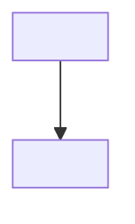
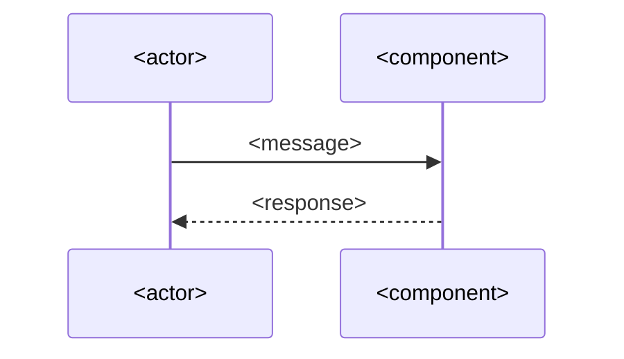

# <YYYY-MM-DD_descriptive-short-name> — diagrams

**Status:** PLANNED · updated <YYYY-MM-DD>

<`PLANNED` while this describes the intended shape; `AS BUILT` once `/story-check` has refreshed
it against the real code. There is only ever one copy of this file — it is edited in place.>

## The model in plain English

<Three to six sentences. What the pieces are, what they are called, and what causes what. A
reader who knows the language but not this codebase should be able to follow the diagrams below
after reading only this. Define any term the diagrams use that the reader would not already
know.>

## Components

<What talks to what, and across which boundary. One altitude — no zoom-ins.>

## Sequence

<The happy path end to end, plus the one failure mode that matters. This is the diagram you will
be asked to narrate back at the gate.>

## State

<Optional — include only if something in this change genuinely has states and transitions. Delete
this whole section if it does not earn its place. Three diagrams is the cap.>

## Why not the obvious thing

<The approach a competent reader would expect here, and the specific reason this case does
something else. One short paragraph per rejected alternative, at most two. If nothing obvious was
rejected, say so in one line rather than inventing a strawman.>

## Read the code in this order

<Entry points, in reading order. `file:line` pointers are filled in with real values by
`/story-check`; before the build they name files and describe what to look for.>

1. `<path>` — <what this file establishes>
2. `<path>` — <what to look at next and why>
